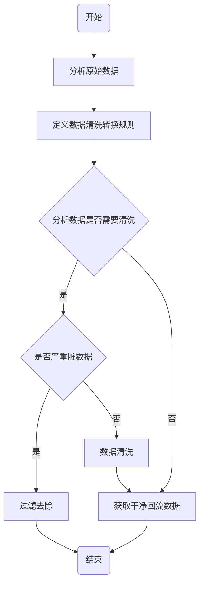

## 一、概述

如同其他信息技术一样，标准化是大数据发展的基础和前提。通过标准化，可以打破大数据的信息孤岛、数据烟囱，能够有效整合资源、固化创新成果、形成统一规范、提供安全保障。通过标准化，可以带动和激发大数据在构建数字经济、提升治理现代化水平、保障改善民生等各方面工作的巨大优势，实现最佳秩序和最大经济社会效益。

## 二、大数据标准

### 1、基础标准

#### ① 概念定义

<table>
	<tr>
        <th align="center">类别</th>
	    <th align="center">词汇</th>
	    <th align="center">说明</th>  
	</tr >
	<tr>
	    <td rowspan="2" align="center">业务</td>
	    <td  align="center">业务域</td>
	    <td>业务域通常是联系较为紧密的业务主题的集合。可以根据业务的关注点，将这些业务【数据】主题划分到不同的业务域。业务域的确定应该是由最终用户和数据仓库的设计人员共同完成。</td>
	</tr>
	<tr>
	    <td  align="center">业务主题</td>
	    <td>业务主题是对业务域进一步分解、细化的过程。业务域下面可以有多个业务主题，每个业务主题可能有多个实现实体对象，每个实体对象则是不可划分的最小单位，其和【业务主题宽表】一一对应。</td>
	</tr>
	<tr>
        <td rowspan="4" align="center">数仓分层</td>
        <td  align="center">ODS层</td>
	    <td>原始数据源层【贴源侧】，是数据仓库中最接近数据源的一层。ODS层以【表】为粒度同步业务数据库的数据到数据仓库中。</td>
	</tr>
	<tr>
	    <td  align="center">DWD层</td>
	    <td>数据明细层，ODS层数据经过【ETL】过程后进入数据明细层，该层数据一般保持和ODS层同样粒度。</td>
	</tr>
	<tr>
        <td align="center">DWM层</td>
	    <td>数据模型层，该层会在DWD层的数据基础上，按照业务做【维度建模方法】，事实表和维度表按照星型、雪花模型来组织。</td>
	</tr>
	<tr>
	    <td align="center">APP层</td>
	    <td>数据应用层，或者叫报表数据，主要是存放业务主题宽表，由事实表和维度表关联而来。</td>
	</tr>
	<tr>
	    <td rowspan="10" align="center">数据仓库模型</td>
	    <td align="center">维度</td>
        <td>维度是分析问题的一个窗口，是人们洞察数据的特定角度，是考虑问题时的一类属性。这类【窗口角度属性】的集合构成一个维度。</td>
	</tr>
	<tr>
	    <td align="center">度量</td>
	    <td>度量是被聚合的统计值字段，也是聚合运算的结果。</td>
	</tr>
	<tr>
	    <td align="center">维度基数</td>
	    <td>英文Cardinality，是维度数据集中出现的不同值的个数，例如【国家】这个维度，有200+个不同的值，此维度的基数就是200+，通常一个维度的基数会从几十到几万个不等，个别维度如【用户ID】的基数会超过百万甚至千万，基数超过一百万的维度通常被称为【超高基数维度(Ultra High Cardinality/UHC)】，维度基数越高往往代表数据越明细，超高基数维度会大大增加数据分析的复杂度。</td>
	</tr>
	<tr>
	    <td align="center">事实表</td>
	    <td>事实表是数据仓库结构的【中心表】，其包含事实的【业务数字度量值】和关联维度表的【外键值】。事实数据表包含描述业务【例如银行交易】特定事件的数据。</td>
	</tr>
	<tr>
	    <td align="center">维度表</td>
	    <td>维度表是维度属性的集合。</td>
	</tr>
	<tr>
	    <td align="center">星型模型</td>
	    <td>多张维度表都连接到同一张事实表。</td>
	</tr>
	<tr>
	    <td align="center">雪花模型</td>
	    <td>雪花模型有部分维度表连接到事实表。雪花模型是当有一个或多个维表没有直接连接到事实表上，而是通过其他维表连接到事实表上时，其图解就像多个雪花连接在一起，故称雪花模型。雪花模型是对星型模型的扩展。</td>
	</tr>
	<tr>
	    <td  align="center">拉链表</td>
	    <td>顾名思义，所谓拉链，就是数据历史变更过程，记录一个事物从开始，一直到当前状态的所有变化的信息，是解决数据仓库查变更的效率问题。</td>
	</tr>
    	<tr>
	    <td  align="center">数据集市</td>
	    <td>简称DM，以某个【应用】或【主题】为出发点而建设的，DM只关心自己需要的数据，主要表现为【业务主题宽表】，不会全盘考虑企业整体的数据架构和应用。每个应用都有自己的DM，所以DM可以基于数仓建设也可以独立建设。</td>
	</tr>
    <tr>
	    <td align="center">业务主题宽表</td>
	    <td>宽表从字面意义上讲就是字段比较多的数据库表。通常是指业务主题相关的指标、维度、属性关联在一起的一张数据库表。由于把不同的内容都放在同一张表存储，宽表已经不符合三范式的模型设计规范，随之带来的主要坏处就是数据的大量冗余，与之相对应的好处就是查询性能的提高与便捷。</td>
	</tr>
    <tr>
	    <td rowspan="2" align="center">建设方法论</td>
	    <td align="center">理论派Inmon</td>
	    <td>Inmon 强调自顶向下，提倡以【三范式】构建集中式的【企业数据仓库(EDW)】，是整个系统核心。其上层再建设【面向主题】【遵循维度模型设计】的数据集市。【应用和产品】连接和访问数据集市，而不能直接访问企业数据仓库(EDW)。</td>
	</tr>
    <tr>
	    <td align="center">实践派Kimball</td>
	    <td>Kimball强调自底向上，主张维度建模，是数据仓库总线结构，以【星型模型】或【雪花模型】等方式构建【维度数据仓库】。在架构体系中，数据集市于维度数据仓库是紧密结合的，数据集市是数据仓库中一个【逻辑】上的【主题域】。【应用和产品】可以直接访问和使用维度数据仓库。</td>
	</tr>
</table>
#### ② 术语定义

| 名称         | 英文名称             | 解释                                                         |
| :----------- | :------------------- | ------------------------------------------------------------ |
| 数据采集     | data acquisition     | 数据采集是指对数据资源进行收集并形成原始记录的过程。         |
| 脏数据       | dirty data           | 脏数据是指系统中的数据不在给定的范围内或对于实际业务毫 无意义，或是数据格式非法，以及在系统中存在不规范的编码和含糊的业务逻辑。 |
| 数据清洗     | data cleaning        | 数据清洗是指利用现有的数据挖掘手段和方法清洗“脏数据”，将“脏数据”转化为满足数据质量要求或应用要求的数据的过程。 它是发现并纠正数据文件中可识别的错误的一道重要程序。 |
| 结构化数据   | structural data      | 结构化数据也称作行数据，是由二维表结构来逻辑表达和实现的数据，严格地遵循数据格式与长度规范，主要通过关系型数据库进行存储和管理。 |
| 非结构化数据 | unstructured data    | 非结构化数据是数据结构不规则或不完整，没有预定义的数据模型，不方便用数据库二维逻辑表来表现的数据。 |
| 半结构化数据 | semi-structured data | 非结构化数据处于结构化数据与非结构化数据之间，具有一定的结构，但是缺乏由底层数据模型规定的严格结构。 |

### 2、数据标准

数据标准是进行数据标准化、消除数据业务歧义的主要参考和依据。对数据标准进行分类，将有利于数据标准的编制、查询、落地和维护。 

数据可以分为基础类数据和指标类数据。基础类数据指业务流程中直接产生的，未经过加工和处理的基础业务信息。指标类数据是指具备统计意义的基础类数据，通常由一个或以上的基础数据根据一定的统计规则计算而得到。指标类数据具有特定业务和经济含义，且仅能通过基础类数据加工获得。

基础类数据标准和指标类数据标准通过分别建立基础类数据元和指标类数据元，并将基础类数据元和指标类数据元与数据映射，实现基础类数据标准和指标类数据标准的落地。

#### ① 清洗标准

数据清洗总体流程如下：

数据清洗规则包括：非空检核、主键重复、非法代码清洗、非法值清洗、数据格式检核、记录数检核。 

**非空检核**：要求字段为非空的情况下，需要对该字段数据进行检核。 

**主键重复**：多个业务系统中同类数据经过清洗后，在统一保存时，为保证主键唯一性，需进行检核工作。

**非法代码、非法值清洗**：非法代码问题包括非法代码、代码与 数据标准不一致等，非法值问题包括取值错误、格式错误、多余字 符、乱码等，需根据具体情况进行校核及修正。 

**数据格式检核**：通过检查表中属性值的格式是否正确来衡量其准确性，如时间格式、币种格式、多余字符、乱码。 

**记录数检核**：指各个系统相关数据之间的数据总数检核或者数据表中每日数据量的波动检核。

#### ② 转换规则

<table>
	<tr>
        <th>转换规则</th>
	    <th>规则描述</th> 
	</tr >
	<tr>
	    <td rowspan="3">统一时间日期数据格式</td>
	    <td>将各类日期统一为八位的字符日期，如 yyyyMMdd</td>
	</tr>
	<tr>
	    <td>将各类时间统一为六位的字符时间，如 HHmmss</td>
	</tr>
    <tr>
	    <td>将各类日期时间统一为十四位的字符时间日期，如 yyyyMMddHHmmss</td>
	</tr>
    <tr>
	    <td>统一手机号码格式</td>
        <td>将手机号码统一为11位1开头的数字</td>
	</tr>
        <tr>
	    <td>统一身份证号格式</td>
        <td>将身份证号统一为18位数字(最后一位可以为字母X)</td>
	</tr>
</table>

### 3、技术标准

#### ① 可以处理大量数据

拥有PB级数据处理能力，解决大量数据堆积的情况。

#### ② 处理数据类型多样化

不仅仅对结构化的数据能够进行处理，还能够处理一些复杂的数据，例如，文本数据、网页数据等等。

#### ③ 处理速度快

高效的完成数据的处理。

#### ④ 挖掘数据价值

通过从大量的数据中，挖掘出对预测分析有价值的数据，并通过机器学习方法、人工智能方法或数据挖掘方法深度分析，发现新规律和新知识，从而体现数据价值。

### 4、平台和工具标准

平台工具组件：HDFS、YARN、MapReduce2、Tez、Hive、HBase、Pig、Sqoop、ZooKeeper、Storm、Kafka、Spark2

版本：HDP-2.6.5.0

要求：确保各组件兼容性。

### 5、管理标准

组件管理平台：http://node01.sckr.com:8080/

### 6、安全标准

#### ① 数据域权限管理

数据域管理设有四类信息域，所有的数据信息都将被划分到不同的信息域中，即公开域（一级域）、普通域（二级域）、敏感域（三级域）、保密域（四级域）。信息若被划分到公有域，则表示该信息满足数据权限等级的用户均可查看；信息若被划分到私有域则表明该类信息只有本级机关且满足数据权限等级的用户可查看；信息若被划分到普通域内，则表明该类信息按照权限体系控制，即上级机关且满足数据权限等级的用户可查看下级单位数据。

#### ② 红白名单管理

根据红白名单设置，来控制数据访问权限。

#### ③ 存储备份

为了避免因宕机、网络原因导致数据丢失。一份数据在存储时，保存多个副本。

### 7、行业应用标准

#### ① 规范第三方提供的数据内容、格式

#### ② 规范输出数据的内容、格式